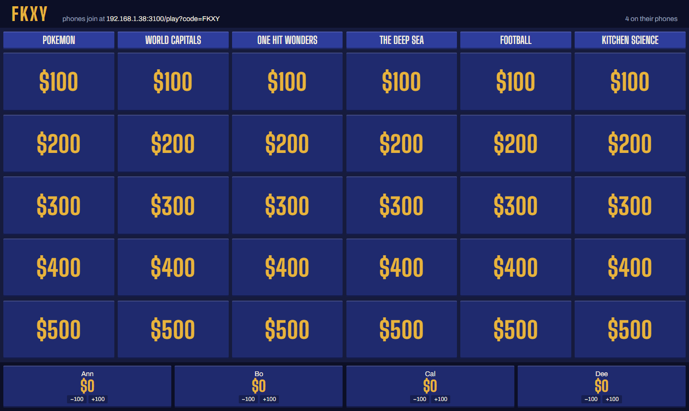
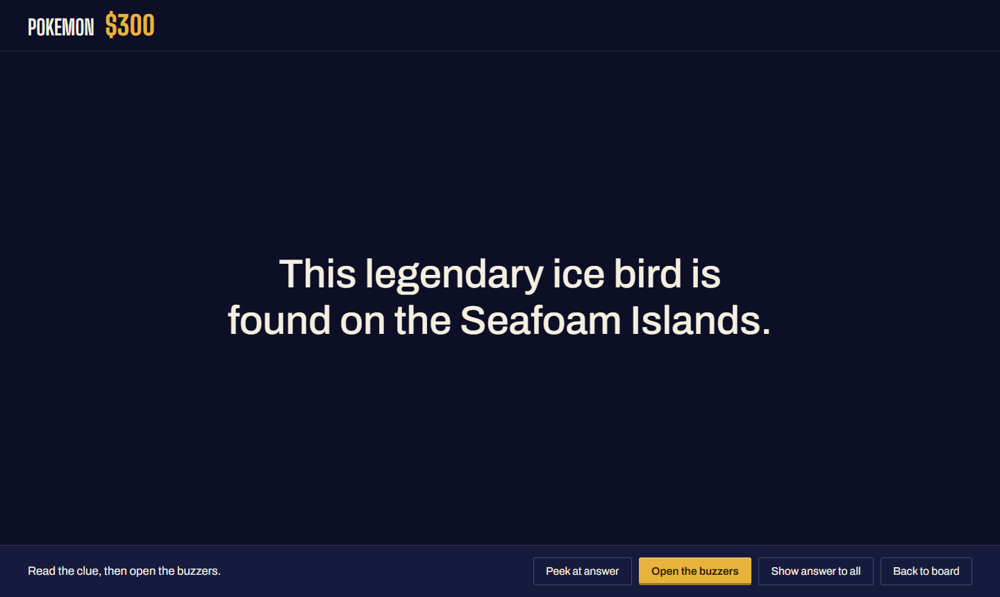
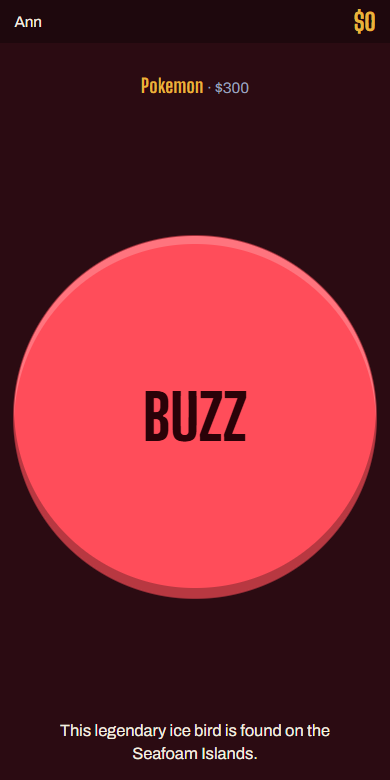

# Buzz Night

A Jeopardy-style party game. The board goes on a laptop or TV, your friends buzz
in from their phones, and you decide who got it right.

- **No app, no accounts.** Phones join a four-letter code in a browser.
- **You are the judge.** Answers are free-text and fuzzy, so a human ruling beats
  any string match. Correct awards the value, Wrong deducts it and lets the
  others buzz — like the real show.
- **Categories can be written or generated.** Type a theme like `Pokemon` and
  Claude writes five clues rising from $100 to $500, which you then edit before
  playing.

## What it looks like

| The board | A clue | A phone |
|---|---|---|
|  |  |  |

## Running it

```bash
npm install
npm start
```

The console prints two addresses:

```
Host screen:  http://localhost:3000      <- you, on the laptop
Phones join:  http://192.168.1.38:3000   <- everyone else, same wifi
```

Open the host address, click **Host**, build a board, and read the join address
out to the room. Change the port with `PORT=4000 npm start`.

### Turning on AI categories

Set **one** API key and restart. Which provider gets used is worked out
automatically from the key you set — there is nothing to choose in the UI, and
the host screen names the model it is using.

The tidiest way is a `.env` file, which `npm start` picks up automatically and
which git ignores:

```bash
cp .env.example .env
# open .env, paste your key, save
npm start
```

Or pass it on the command line for one run:

```bash
OPENROUTER_API_KEY=sk-or-...  npm start          # macOS / Linux
```

```powershell
$env:OPENROUTER_API_KEY="sk-or-..."; npm start   # Windows PowerShell
```

Keep the key out of anything you share — chat windows and screenshots included.
If one leaks, rotate it at [openrouter.ai/keys](https://openrouter.ai/keys).

Without a key everything else still works — you just write the clues yourself.

| Variable | Default | What it does |
|---|---|---|
| `ANTHROPIC_API_KEY` | — | Enables Anthropic. Get one at [console.anthropic.com](https://console.anthropic.com) |
| `OPENROUTER_API_KEY` | — | Enables OpenRouter. Get one at [openrouter.ai/keys](https://openrouter.ai/keys) |
| `AI_PROVIDER` | auto | `anthropic` or `openrouter`. Only needed if both keys are set — Anthropic wins the tie otherwise |
| `ANTHROPIC_MODEL` | `claude-opus-5-5` | |
| `OPENROUTER_MODEL` | `google/gemini-3.8-flash` | Any id from [openrouter.ai/models](https://openrouter.ai/models) |
| `OPENROUTER_BASE_URL` | OpenRouter | Point at a proxy or gateway instead |

A category costs roughly a cent on Claude Opus, or about a fifth of that on the
default OpenRouter model.

**Picking an OpenRouter model.** Prefer one that supports structured outputs —
filter the [models page](https://openrouter.ai/models?supported_parameters=structured_outputs)
by that parameter. Models without it will usually still work, because every
response is validated and retried once regardless of provider, but they fail
more often. Cheap models also get trivia facts wrong noticeably more, which
matters more here than raw fluency.

**Check what it writes.** Generated clues land in an editable grid, not straight
onto the board, because models get trivia facts wrong often enough to spoil a
game. Reading them through takes a minute and is worth it.

## Playing

1. **Build the board.** Up to six categories, five clues each. Write them,
   generate them, or load one you saved. The **×** on a column removes it and
   **Add category** puts one back, so a quick three-category round is a couple
   of clicks. One category is the minimum.
2. **Tick what you are playing.** **Second round** adds a whole second board at
   $200–$1000; **Final Jeopardy** adds one last clue. Both are written now, so
   nobody waits mid-game — only the first board is on screen when you start.
3. **Start the game** once people have joined. The board locks at this point.
4. **Pick a clue.** It fills the screen. Read it out loud.
5. **Open the buzzers** when you have finished reading. Until you do, every
   phone says *Wait* — this is what stops people mashing the button early.
6. **Rule on it.** Whoever buzzed first appears on screen. Correct adds the
   value; Wrong subtracts it, locks that player out of this clue, and re-opens
   the buzzers for everyone else.
7. **Start round 2**, if you are playing one. The board pauses on a scoreboard
   when the last clue closes, so you can read the scores out before the second
   board goes up. Round 2 runs $200–$1000 and hides **two** Daily Doubles.
8. **Finish with Final Jeopardy**, if you turned it on. The same scoreboard
   offers it once the last board is done.

### Final Jeopardy

Everyone bets first, in secret, from $0 up to their own score, in hundreds.
Someone on nothing is still in the round — they simply cannot move their score.
You will not be able to show the clue until the last bet is in, and no phone
can see the clue before then: betting with the question in front of you is not
Final Jeopardy.

Then the clue goes up and everyone has **30 seconds** to type an answer, and
they can change it as often as they like until time is up. When the clock runs
out the window shuts; anything not sent is not an answer, and that player is
revealed with a blank. You can also call time early with **Everyone's in**. The
clock only closes the window — you still choose when the reveal begins.

Answers are turned over one at a time, **poorest first**, each with the bet
that player staked, for you to rule Correct or Wrong. Nobody can be taken below
$0, because nobody can stake more than they hold.

Host keyboard shortcuts, since you will be looking at the room and not the
screen: `Space` opens the buzzers, `Y` correct, `N` wrong, `Esc` back to board.

### The Daily Double

One square on every board is the Daily Double, hidden at random when you start
the game — you will not know where it is either, which is the point.

Open it and the board says **DAILY DOUBLE** instead of showing the clue. Tap
whoever picked the square and the bet lands on *their* phone: two big buttons,
hundreds only, anywhere from $100 up to their own score or the biggest value on
the board, whichever is more. Someone on nothing can still swing $500.

Nobody else can buzz. The clue stays off every phone until the bet is locked,
so nobody is betting with the question in front of them. Then you read it, and
Correct or Wrong moves their score by the bet rather than the square's value. A
miss ends the clue — it was never open to the room.

### If you are casting to a TV

The clue screen deliberately never shows the answer — the **Peek at answer**
button puts it in small type down in the control bar instead, and **Show answer
to all** is what puts it on the big screen for everyone.

## Hosting it so your computer can stay off

Any host that runs a Node process works. It needs a real process, not a static
host — GitHub Pages and the like cannot run this, because the game is a server
holding live room state.

### Railway

The repo includes `railway.json`, so Railway needs no extra setup beyond the
environment variables.

1. Push this folder to a GitHub repo.
2. In Railway: **New Project → Deploy from GitHub repo**, pick it.
3. Under **Variables**, set:

   | Variable | Value |
   |---|---|
   | `OPENROUTER_API_KEY` | your key |
   | `HOST_PASSWORD` | optional — see below |
   | `DATABASE_URL` | set by Railway when you add Postgres |
   | `GOOGLE_CLIENT_ID` / `GOOGLE_CLIENT_SECRET` | for sign-in |
   | `SESSION_SECRET` | any long random string |

4. Under **Settings → Networking**, click **Generate Domain**. That URL is the
   game.

Railway sets `PORT` and `RAILWAY_PUBLIC_DOMAIN` itself; the server reads both.

**`HOST_PASSWORD` is optional.** Leave it unset and anyone can host a game,
which is the point if you want the link to be shareable. Set it and starting a
game asks for the password once — useful for a private instance. Either way the
AI spend is capped (see below), so an open instance is not an open wallet.

### Saved boards and accounts

Boards are saved to an account, so they follow you to any device — and so one
host can never read another's answers. Signing in is optional and unlocks only
saving: hosting, playing and generating categories all work signed out.

1. **Add Postgres** in Railway (New → Database → PostgreSQL). It sets
   `DATABASE_URL` for you. Use the internal connection string; the schema is
   created automatically on first boot.
2. **Create a Google OAuth client** at
   [console.cloud.google.com](https://console.cloud.google.com) → APIs &
   Services → Credentials → Create credentials → OAuth client ID → *Web
   application*. Add this to **Authorised redirect URIs**:

   ```
   https://<your-railway-domain>/auth/google/callback
   ```

   Then set `GOOGLE_CLIENT_ID` and `GOOGLE_CLIENT_SECRET` in Railway.
3. **Set `SESSION_SECRET`** to any long random string, or everyone is signed out
   whenever the service restarts.

While the Google consent screen is in *Testing* mode only the accounts you list
can sign in; publishing it is a form rather than a review for plain
email/profile access.

### Keeping the AI bill bounded

Because anyone can host, generation is rate limited rather than gated:
`GEN_PER_IP_PER_HOUR` (default 20 — a board is six) and `GEN_PER_DAY` (default
500, roughly a dollar). Set a hard spend limit on the provider key as well; that
is the backstop that holds even if this has a bug.

### Just for tonight

If you would rather not deploy, a tunnel gives your laptop a public URL without
touching the firewall or the router — but only while the laptop is on:

```bash
cloudflared tunnel --url http://localhost:3000
```

## How it is built

A single Node process serving static files and a WebSocket. No build step, no
framework, no database.

```
server.js            HTTP + WebSocket, room registry, message routing
lib/game.js          the rules as pure functions - phases, buzzing, scoring
lib/board.js         board shape and validation, shared by all three input paths
lib/generate.js      picks a provider, validates and retries the result
lib/db.js            users and saved boards, in Postgres
lib/auth.js          Google sign-in and the session cookie
lib/ai/shared.js     the prompt, the schema, and the category conversion
lib/ai/anthropic.js  Anthropic adapter
lib/ai/openrouter.js OpenRouter adapter (plain fetch, no extra SDK)
public/              the three screens, as plain HTML/CSS/JS
test/game.test.js    unit tests for the rules
test/generate.test.js  generation, against a mock OpenRouter
test/db.test.js      the real schema and queries, on an in-memory Postgres
test/auth.test.js    session cookie signing and tampering
scripts/smoke.mjs    end-to-end test against a running server
railway.json         deploy config for Railway
```

**Why one process and not serverless.** A room is shared mutable state with
exactly one correct buzz order. One always-on process is its own authority:
because Node handles messages on a single thread, "the first buzz message off
the socket wins" needs no locking or external coordination. Serverless functions
would need a separate real-time service to decide the same question.

**`lib/game.js` is pure on purpose.** Every rule that can be got subtly wrong —
lockouts, re-arming, who may buzz — is a plain function over a state object, so
it is tested without a browser, a phone, or a network.

### Tests

```bash
npm test     # rules, in isolation - no server needed
npm start    # in one terminal
npm run smoke  # in another: full game over real sockets
```

The smoke test fires simultaneous buzzes and asserts exactly one wins, that the
loser is told once, and that answers are never sent to a phone before the host
reveals them. `npm test` also runs the OpenRouter adapter against a mock
OpenRouter, covering the request shape and every failure branch without a key.

## Known limits

- **Rooms are in memory.** Restarting the server — or a redeploy — ends any game
  in progress. Saved boards live in Postgres and are unaffected.
- **Sign-in needs both halves.** Without a database *and* Google credentials,
  saving is switched off and the page says so; everything else still works.
- **Buzz fairness is arrival order.** Someone on worse wifi is at a real
  disadvantage of a few tens of milliseconds. Fine among friends in one room;
  worth knowing if people are remote.
- **Remote play needs a tunnel.** The LAN address only works on your wifi. For
  friends elsewhere, expose the port with something like
  `cloudflared tunnel --url http://localhost:3000` and share that address.
- **Not yet built:** sound, and any timer outside Final Jeopardy's 30 seconds.
  The main rounds stay untimed — you open the buzzers when you have finished
  reading.
- **A player who joins after Final Jeopardy's betting opens sits it out.** The
  round's line-up is fixed when the betting starts, so a latecomer cannot hold
  up the clue. They keep their score and the scoreboard still shows them.
- **One Daily Double in round 1, two in round 2**, as the show plays it. They
  never share a category unless the round is too short to avoid it.
- **Fonts come from Google Fonts.** Playing fully offline falls back to system
  faces, which looks plainer but works.
- **Schema compliance varies by model.** OpenRouter routes a model through
  whichever upstream provider is available and not all of them enforce a JSON
  schema, so every response is validated here and retried once. A model that
  fails twice reports itself rather than producing a broken category.

## Renaming it

"Buzz Night" appears in the three `public/*.html` titles, the landing page
heading, and this file. Nothing depends on the name.
